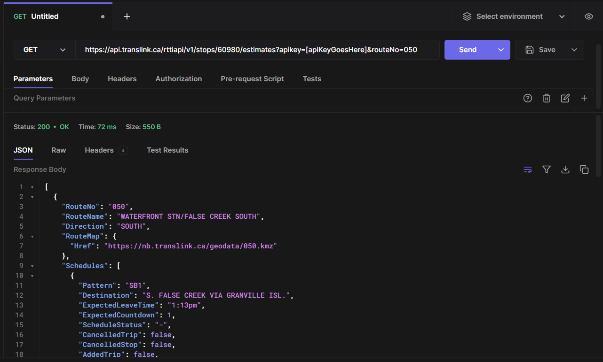
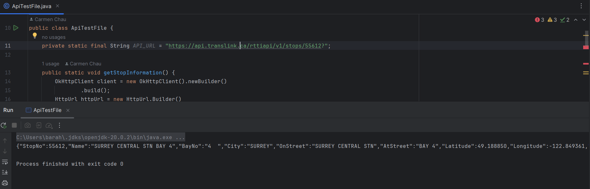

<div align='center'>
    <!-- project title is up for debate!! -->
    <h1><b>FindMyBus</b></h1>
    <div>A project by Aaron Aranda, Carmen Chau, Jacquelyn Lu, and Jason Barahan</div>
</div>

## Project Domain
Our project domain focuses on public transportation - namely, the data commuters rely on to be informed and to make decisions.

## The application
Our team plans to develop a GUI-based application that allows users to retrieve bus service information in Vancouver, with planned features including <a href="https://github.com/JasonBarahan/csc207-project/issues/4">predicted departures</a> from a stop, <a href="https://github.com/JasonBarahan/csc207-project/issues/2">visualizations</a> of current bus positioning, and <a href="https://github.com/JasonBarahan/csc207-project/issues/3">service updates</a>. User-sought information will be organized in a single-pane dashboard. Frequently sought data by a single user can be <a href="https://github.com/JasonBarahan/csc207-project/issues/5">saved</a>, minimizing the time needed for users to retrieve information.

This involves retrieving input data from users, organizing it into and retrieving data from API calls, displaying and visualizing data, and writing data (for frequently searched routes on a per-device basis).

More features can be found <a href="https://github.com/JasonBarahan/csc207-project/issues?q=is%3Aissue+is%3Aopen+label%3Aenhancement">here</a>.

## API
The API we plan to use extensively in our application is a "Real-time Transit Information" Open API provided by TransLink (the agency responsible for managing bus operations in the Greater Vancouver area.) This API supports GET calls only (no posting allowed).

### Sample usage
<ul>
    <li>API call using Hoppscotch: <br>
    
    <li> API call using Java: (refer to pull request <a href=https://github.com/JasonBarahan/csc207-project/pull/10">#10</a>) <br></li>

    ```
    import okhttp3.HttpUrl;
    import okhttp3.OkHttpClient;
    import okhttp3.Request;
    import okhttp3.Response;
    import org.json.JSONException;
    
    import java.io.IOException;
    
    
    public class ApiTestFile {
        private static final String API_URL = "https://api.translink.ca/rttiapi/v1/stops/55612?";
    
        public static void getStopInformation() {
            OkHttpClient client = new OkHttpClient().newBuilder()
                    .build();
            HttpUrl httpUrl = new HttpUrl.Builder()
                    .scheme("https")
                    .host("api.translink.ca")
                    .addPathSegment("rttiapi")
                    .addPathSegment("v1")
                    .addPathSegment("stops")
                    .addPathSegment("55612?")
                    .addQueryParameter("apikey", System.getenv("API_KEY"))
                    .build();
    
            Request request = new Request.Builder()
                    .url(httpUrl)
                    .addHeader("content-type", "application/json")
                    .build();
            try {
                Response response = client.newCall(request).execute();
                System.out.println(response.body().string());
    
            } catch (IOException | JSONException e) {
                throw new RuntimeException(e);
            }
        }
    
        public static void main(String[] args) {
            getStopInformation();
        }
    }
    ```


<li>Response: <br>
</li>
</ul>


## Issues and next steps
<ul>
    <li>We originally planned to feature GO Transit (and do have plans to switch to an API for this purpose). However, Metrolinx (agency responsible for GO) requires potential API users to be vetted, which takes time - so we are using an API for a Vancouver-based operator while we wait.</li>
    <li>Their API can be found <a href="http://api.openmetrolinx.com/OpenDataAPI/Help/Index/en">here.</a></li>
</ul>

### Links
<!-- Some of the links here are empty and need to be filled. -->
<ul>
    <li><a href="https://www.translink.ca/about-us/doing-business-with-translink/app-developer-resources/rtti">API documentation</a> courtesy of TransLink</li>
    <li>Disclaimer: <br>"Route and arrival data used in this product or service is provided by permission of TransLink. TransLink assumes no responsibility for the accuracy or currency of the Data used in this product or service.”</li>
</ul>
